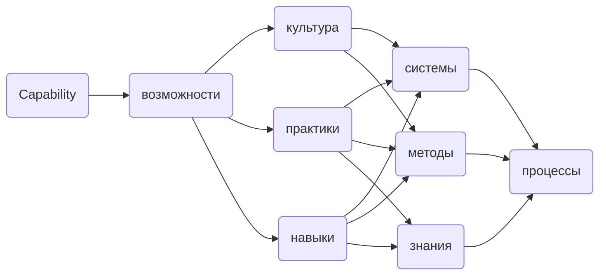
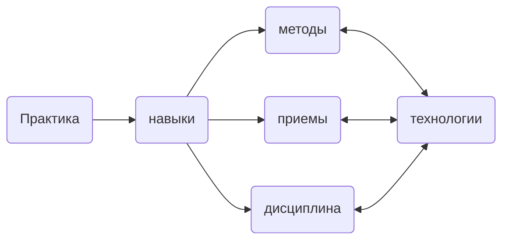
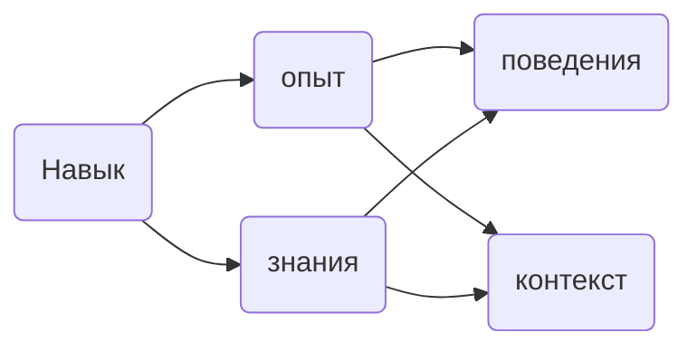

# Термионология

`Capability` – возможности или же способности которые нужны бизнесу для реализации стратегии, включает в себя, но не ограничиваясь, знания, навыки, практики, методы, процессы, системы, культуру и иные ресурсы для реализации стратегии.

Из чего складывается `Capability`:

---

`Практика` – это навыки, методы, приемы накопленные в результате какой-либо деятельности с помощью использования определенных технологий.

Из чего складывается `Практика`:

---

`Навык` – это умение, что либо делать, который состоит из опыта и знаний, демонстрируется с помощью поведенческих факторов и контекста ситуации.

Из чего складывается `Навык`:

